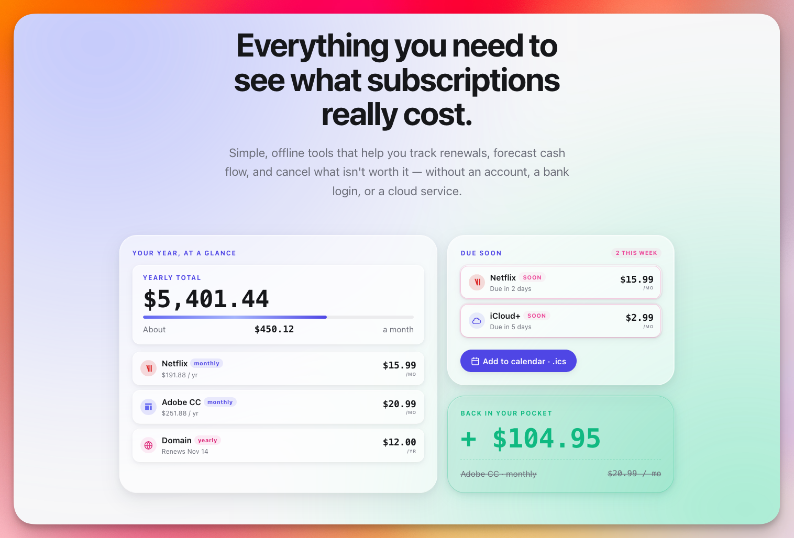

  

# Forgettie

**See what your subscriptions really cost you — and get ahead of every renewal.**

🔗 **Open the app:** https://forgettie.dumbnote.app

## The problem

A few dollars here, a yearly renewal there. Streaming, cloud storage, insurance, that domain you bought in 2019. Each one feels small on its own — and that's the trap. By the end of the year the total is usually bigger than you thought, and the charges keep arriving on dates you can't quite remember.

## How Forgettie helps you save

- **Group what you pay.** Put every subscription and recurring bill in one place. Once you can see the full list, it's a lot easier to spot the one you stopped using six months ago.
- **See it annualized.** Forgettie does the math: monthly, yearly, one-offs — all normalized into what it really costs you per year. The "$9.99" quietly becomes "$120" and the decision gets easier.
- **Forecast the months ahead.** Know what's coming up and when, so you can plan your cash flow, move money around, or cancel before the next charge lands — not after.
- **Never miss a renewal.** Get a quiet reminder before a bill is due — and export any due date straight to your calendar (Google, Apple, Outlook) so the nudge lives wherever you already look.

## Private by design

Your list lives on your device. No account, no sign-up, no server to trust. Install it to your home screen and it works offline like a native app.

Small tool. Clearer picture. Money you actually meant to spend.

---

## Want to explore? Features at a glance

If you're curious what's inside before you try it:

- **Any cadence** — monthly, yearly, or one-off payments.
- **Tags & grouping** — tag each item (Streaming, Insurance, Domains…) and group your list by tag to see category totals.
- **Tag filters** — pick one or more tags to narrow the view; filter is *any*, not *all*, so broad searches are fast.
- **Sort the way you think** — by next due date, by annual cost, or alphabetically.
- **Due-date chips** — every item shows "in 4 days" or "3 days ago" at a glance.
- **In-app reminders** — surface what's due soon, right when you open the app.
- **Calendar export (.ics)** — drop any due date into Google, Apple, or Outlook calendar with one tap.
- **Dark mode** — follows your system, with a hand-tuned dark theme.
- **Install as an app** — add to home screen on iOS, Android, or desktop; opens in its own window and works offline.
- **Fully local** — your data never leaves your device.
